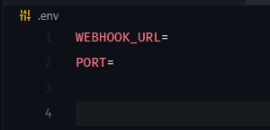

<div align="center">
<h1>Disco Hooker</h1>

[](https://github.com/psf/black)
[](https://pypi.org/project/leafengine/)
[](https://pycqa.github.io/isort/)
[](https://github.com/pylint-dev/pylint)
[](https://github.com/DroidZed/disco-hooker/actions/workflows/docker-image.yml)

</div>

<div>

## Intro

Thi is a simple Discord Hook notifier backend written in `flask` & `discord-webhook`.


## Usage:

1. Docker image:

   a. Pull the image:

   ```sh
   docker pull droidzed/disco-hooker:latest
   ```

   b. Run the container:

   ```sh
   docker run -d -p 6000:6000 -e PORT=6000 -e WEBHOOK_URL=YOUR_DISCORD_WEBHOOK_URL droidzed/disco-hooker:latest
   ```

2. Run locally:

   a. Clone the repo:

   ```sh
   git clone https://github.com/DroidZed/disco-hooker.git
   ```

   b. Install deps:

   ```sh
   pipenv install
   ```

   c. Create `.env` file like so:
   <br>Make sure to fill in the required variables !

   

   d. Run:

   ```sh
   py app.py
   ```

3. API Request:

   

</div>

## Useful links:

[Discord Webhooks](https://support.discord.com/hc/en-us/articles/228383668-Intro-to-Webhooks)
<br>[Discord Webhooks & Safety](https://discord.com/safety/using-webhooks-and-embeds)
